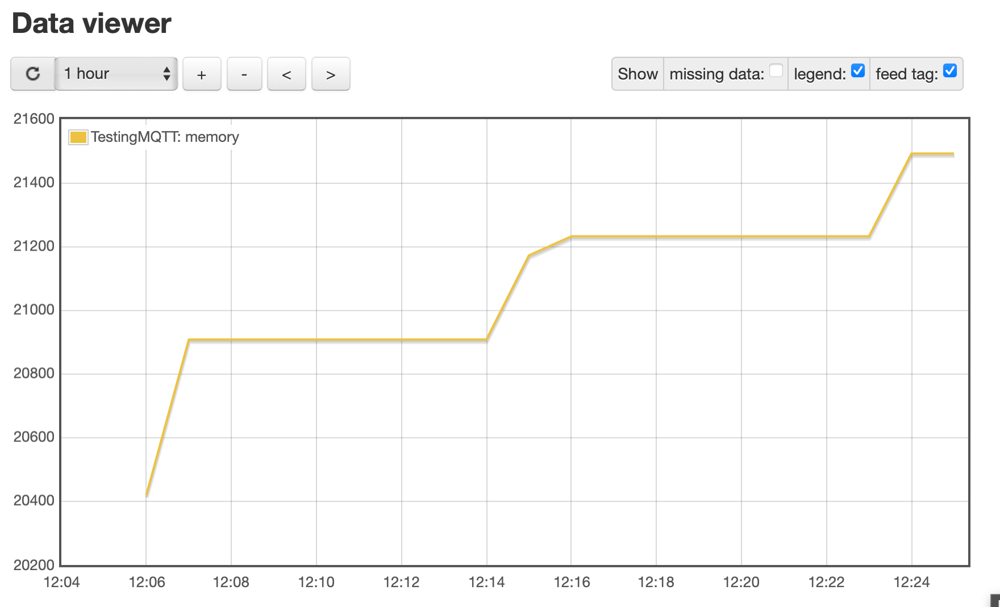
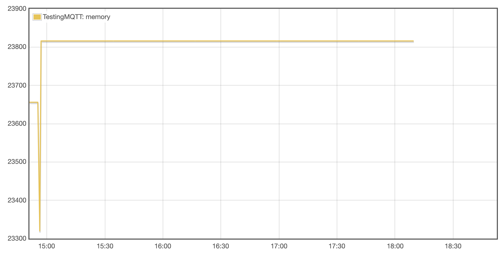

## Testing emoncms_mqtt.php

The memory usage of ```emoncms_mqtt.php``` is tested on two installs. 
The test script ```testing_code/MQTTlog.py``` exposes x inputs via MQTT to EmonCMS. The value of the input is the memory currently in use by ```emoncms_mqtt.php```. The number of inputs and the MQTT settings can be configured through ```testing_code/config.ini```.

The Emonscripts install increases memory regularly when running. This happens already for 1 input every 10 seconds but also for higher number of inputs. Just scrolling through the logs ```emonscripts_install/emoncms.log``` gives an idea of the increase in memory usage.



The EmonSD install only increases memory once after boot and stays constant after that even at 10 inputs every 10 seconds.



For both tests, one input is logged to a feed every 10 seconds. The graphs and logs can be found in ```emonscripts_install/``` and ```emonSD_10Nov22/```.

